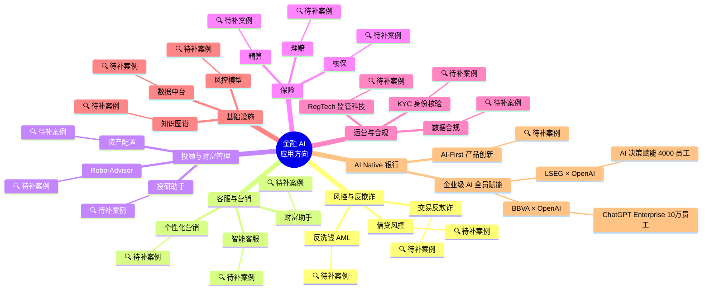

# 金融 · AI 应用方向思维导图

> **目标读者**：求职 AI 产品经理 / AI 应用 PM 时作为「行业理解深度」证据
> **可视化**：Mermaid 思维导图（GitHub / GitHub Pages 原生渲染）
> **配套文件**：[AI落地行业地图 v2](D:\Learning\AI\AI项目落地研究\01_行业地图\AI落地行业地图_v2.md) | [3年趋势压力测试 v2](D:\Learning\AI\AI项目落地研究\07_红队质询\3年趋势压力测试_v2.md)
> **最后更新**：2026-06-22
> **筛选原则**：每个方向的案例都是公开可查、有数据 / 公司名 / 落地证据。空方向标「🔍 待补」。

---

## 思维导图

---

## 已挂上的真实案例（来自 2026-06 周更）

| 案例 | 应用方向 | 国家 | 关键数据 |
|---|---|---|---|
| [BBVA × OpenAI](https://openai.com/index/bbva/) | AI Native 银行 → 企业级 AI 全员赋能 | 西班牙 | ChatGPT Enterprise 部署至全球 10 万名员工 |
| [LSEG × OpenAI](https://openai.com/index/lseg/) | AI Native 银行 → 企业级 AI 全员赋能 | 英国 | AI 决策赋能 4000 名员工，发布周期缩短 |

> **当前进度**：骨架已建立（7 大方向 × 19 子方向），**2 个真实案例挂载**（都是「企业级 AI 全员赋能」新方向）。
> **我建议的新方向**：「AI Native 银行」= 整家银行把 AI 当作全员工具而非单点场景。BBVA + LSEG 是同一个模式。
> **下一步**：等用户手动挑更多案例 / 确认新方向 / 补传统方向（风控 / 客服 等）的国内案例。

---

## 如何补案例

1. **从周更新案例里挑**：每周一 cron 跑完后我来汇报本周新抓的金融案例
2. **从历史 / 公开资料补**：你手动找的案例（贴链接 / 标题给我）我帮你判定方向
3. **方向新增**：如果某个案例不属于现有 6 大方向，我建议新增方向（如「企业 AI 全员赋能」可能是新方向）

---

## 与求职作品集的连接

- 这个思维导图证明：**你能把「AI 技术」翻译成「行业子方向 × 真实落地」**
- 面试场景：被问「你怎么看 AI 在金融的落地？」→ 你能说「我梳理过 6 大方向 17 子方向，已积累 X 个真实案例」→ 调出本文件
- 进一步：每个挂载的案例都能展开 5-10 分钟讲解（公司背景 / AI 技术 / 落地数据 / 失败教训）
